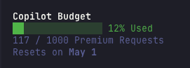

# opencode-copilot-budget

Shows your GitHub Copilot premium request budget in the [OpenCode](https://opencode.ai) TUI sidebar. Only visible when the active provider is `github-copilot`.



## Features

- Progress bar that turns **red** when you reach 90 % of your budget
- Request count and percentage used
- `↻ Refresh` button in the header row, with pointer cursor on hover
- Reset date, updated automatically after prompt submit and after every AI response
- 5-minute cache to avoid unnecessary API calls
- Works with paid and free Copilot plans

## Requirements

- [OpenCode](https://opencode.ai) with `github-copilot` as your active provider
- A GitHub token via one of:
  - `GITHUB_TOKEN` or `GH_TOKEN` environment variable
  - [GitHub CLI](https://cli.github.com) (`gh auth login`)

## Install

### Option A — OpenCode plugin manager

```bash
opencode plugin opencode-copilot-budget
```

This installs the plugin and adds it to your `~/.config/opencode/tui.json` automatically.

### Option B — manual

Add to `~/.config/opencode/tui.json` (create the file if it doesn't exist):

```json
{
  "$schema": "https://opencode.ai/tui.json",
  "plugin": ["opencode-copilot-budget"]
}
```

### Option C — local path (no npm)

Point OpenCode directly at the source file by absolute path:

```json
{
  "$schema": "https://opencode.ai/tui.json",
  "plugin": ["/absolute/path/to/opencode-copilot-budget"]
}
```

## Token setup

The plugin discovers your GitHub token in this order:

1. `GITHUB_TOKEN` environment variable
2. `GH_TOKEN` environment variable
3. Output of `gh auth token` (GitHub CLI)

If none of the above are available, add the token to your shell profile:

```bash
# ~/.zshrc or ~/.bashrc
export GITHUB_TOKEN="ghp_your_token_here"
```

To pull it from the GitHub CLI:

```bash
export GITHUB_TOKEN=$(gh auth token)
```

## What it shows

| Situation | Display |
|---|---|
| Capped plan | progress bar + `117 / 1000 Premium Requests` |
| ≥ 90 % used | progress bar turns red |
| Unlimited plan | `62 used (unlimited)` |
| Overage consumed | `+5 overage` (shown below usage) |
| Reset date known | `Resets on 1 May` (date in bold) |
| Manual refresh | inline `🔄 Refresh` next to the first usage line |
| Token missing / network error | `sync unavailable` |
| First load | `syncing...` |

## Uninstall

Remove `opencode-copilot-budget` from the `plugin` array in `~/.config/opencode/tui.json`.

---

## Contributing

All logic lives in a single file — `src/index.tsx` — so it's easy to get started.

### Local development setup

1. Clone the repo:

   ```bash
   git clone https://github.com/bhaskarmelkani/opencode-copilot-budget
   cd opencode-copilot-budget
   npm install
   ```

2. Point OpenCode at your local clone via an absolute path in `~/.config/opencode/tui.json`:

   ```json
   {
     "$schema": "https://opencode.ai/tui.json",
     "plugin": ["/absolute/path/to/opencode-copilot-budget"]
   }
   ```

3. Edit `src/index.tsx` and restart OpenCode to see changes.

### Codebase overview

```
src/index.tsx   — entire plugin: token discovery, API fetch, caching, and UI
```

| Area | Function / component |
|---|---|
| Token discovery | `discoverToken()` |
| API response parsing (paid + free tiers) | `parseResponse()` |
| Fetch with 5-minute cache | `fetchCopilotUsage()` |
| Progress bar | `ProgressBar` |
| Usage display (SolidJS) | `UsageDetail`, `View` |
| Plugin registration | bottom of file |

### Submitting changes

- Open an issue first for non-trivial changes so we can align on direction
- Keep PRs focused — one concern per PR
- If you add a new display state, update the "What it shows" table above

## License

MIT — see [LICENSE](LICENSE).
